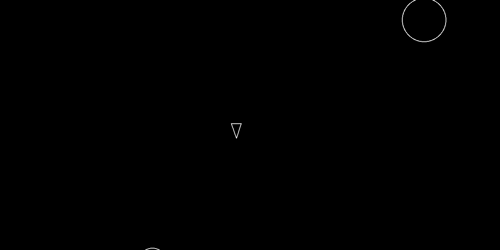

# Asteroids 🚀 — 2D Game Engine Fundamentals with Python

Implementación del clásico **Asteroids** utilizando **Python y Pygame**, desarrollada para profundizar en arquitectura de software, modelado de objetos y sistemas de tiempo real.

El proyecto simula un entorno de juego 2D con manejo de físicas simples, colisiones, generación de enemigos y control del jugador mediante un game loop tradicional.

---

## 🎮 Demo

### 🎥 Gameplay



---

## 🧩 Descripción del sistema

El jugador controla una nave que puede rotar, desplazarse y disparar proyectiles para destruir asteroides.  
El motor del juego administra:

- ciclo principal de actualización (update/render)
- detección de colisiones
- manejo de entidades
- creación y destrucción de objetos
- control de entrada del usuario
---

## 🛠️ Tecnologías

- Python 3
- Pygame

---

## ▶️ Ejecución del proyecto (usando uv)

### Requisitos
- Python instalado

### Crear entorno e instalar dependencias
```bash
uv venv
uv pip install pygame
uv run main.py


